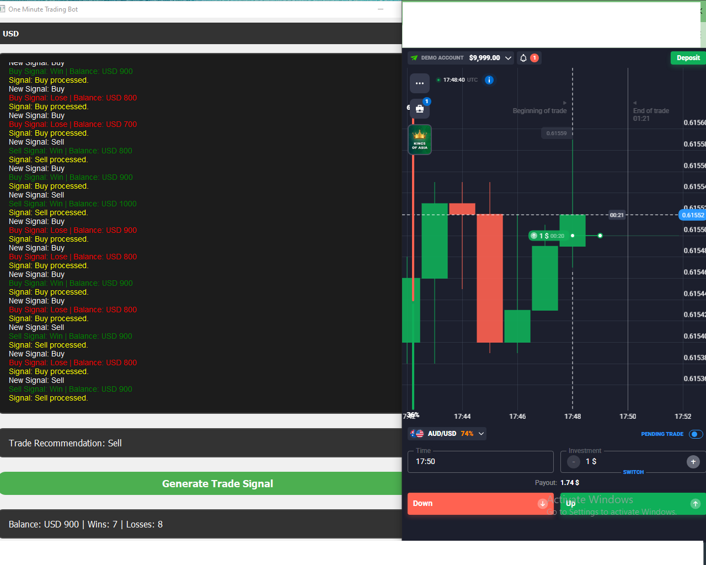

# THEBOT - One Minute Trading Bot

## Your ultimate one-minute trading companion! 🚀

### Overview

THEBOT is an innovative trading bot designed to assist traders in making fast, reliable, and accurate decisions for one-minute trading strategies. Powered by advanced algorithms, it provides actionable trade signals and tracks performance in real-time, making it an essential tool for all levels of traders.

### Key Features

- Generates buy/sell signals based on advanced analysis.
- Supports multiple currencies like USD, EUR, GBP, and more.
- Real-time performance tracking for balance, wins, and losses.
- User-friendly interface with customizable options.

### Download THEBOT Now! 🎯

[Download THEBOT](dist/THEBOT.exe)

### Screenshots

### Made by [Mdbaizidtanvir](https://github.com/Mdbaizidtanvir)

---

## Meta Information

**Description**: THEBOT is a cutting-edge one-minute trading bot designed to assist traders with real-time signals and advanced strategies.  
**Keywords**: trading bot, one-minute trading, trading signals, forex, stock trading, trading algorithm, THEBOT

### Social Media Links
- GitHub: [Mdbaizidtanvir](https://github.com/Mdbaizidtanvir)
- Twitter: [@Mdbaizidtanvir](https://twitter.com/Mdbaizidtanvir)
